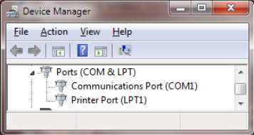

Connection to the radio
=======================

Receive Audio In
----------------

For receiving all you need to do is connect your receiver speaker to the “Line
In” or microphone jack on your computer. If you are using a laptop, with a
built-in microphone, you could probably just set it near your radio’s speaker
in a quiet setting.

Transmit Audio Out
------------------

If you want to transmit, you will need to get audio from the computer to the
microphone input of your transceiver.

PTT signal to activate transmitter
----------------------------------

If you have a serial port (either built-in or a USB to RS232 adapter cable),
the RTS or DTR line can be used to activate the transmitter. (Don’t connect it
directly!!!  You need a transistor switch or opto-isolator.)  GPIO pins can be
used on suitable Linux systems. Otherwise you will need a VOX circuit with a
very short turn off delay.

I highly recommend using some sort of hardware timer to limit transmission
time. Without this, you might end up with your transmitter stuck on for a very
long time. Alternatively some radios have a configurable transmit timeout
setting to limit transmission time.

Others have documented this type of interface extensively so I won’t duplicate
the effort. Many homebrew plans and commercial products are available. A
few random examples:

* http://wa8lmf.net/ham/tonekeyer.htm#NEW
* http://www.ebay.com/itm/EASY-DIGI-USB-Sound-Card-Interface-NO-MORE-USB-RS232-ADAPTERS-/221668996763
* https://sites.google.com/site/kh6tyinterface/
* http://www.qsl.net/wm2u/interface.html
* http://zs1i.blogspot.com/2010/02/zs1i-soundcard-interface-ii-project.html
* http://www.kb3kai.com/tnc/soft-tnc.pdf
* http://www.dunmire.org/projects/DigitalCommCenter/soundmodem/mySoundCardInterface.png

Google for something like ham radio sound card interface or ham radio digital
mode interface to find others.

Don't have a serial port?
-------------------------

Maybe you do but don’t know about it.

My new computer didn’t have a serial port on the back. This was a
disappointment because I still have some useful gadgets that use a good old
fashioned RS-232 port. I was surprised to see a serial port and parallel
printer port displayed in the Device Manager:

|device manager showing com and lpt|

The connectors exist on the motherboard. It was only necessary to add
appropriate cables to bring them out to the rear panel. You can also buy PCI
cards with serial ports or use an adapter cable with USB on one end and RS-232
on the other end.

For best results
----------------

For receiving:

* Leave squelch open. Squelch delay will cut off the start of transmissions.
  You won’t hear the weak ones at all.
* Turn off any battery saver feature. This feature powers the receiver on and
  off rapidly to extend battery life. You will miss the beginning of
  transmissions that come during the power down part of the cycle.
* Turn off any “dual watch” feature. This is actually one receiver scanning
  between two frequencies, not two independent receivers.  

For transmitting:

* Set proper transmit audio level.

  Too low, you won’t be heard. Too high will cause distortion and make decoding less likely.

  Most of us don’t have the test equipment to set the deviation level around 3
  or 3.5 KHz so we need to listen to other signals and set ours around the
  average of what others are sending.
* Avoid use of VOX built into your transceiver.

  This is designed for voice operation and will keep the transmitter on about a
  half second after the transmit audio has ended. This is much too long. Others
  will probably start transmitting before you stop.

  For an explanation, see the section called, "Radio Channel – Transmit Timing."
* If using the Signalink USB, turn the delay down to the minimum (fully counterclockwise).
  According to the documentation, this should turn off the transmitter around 15 or 30 
  milliseconds after the transmit audio has ended.

Mobile Rigs:

* Transceivers designed for mobile use often have a 6 pin mini-DIN “data”
  connector designed specifically for connection to an external modem.  If
  available, use this instead of the speaker and microphone connections. This
  connection has flatter audio response.
 
